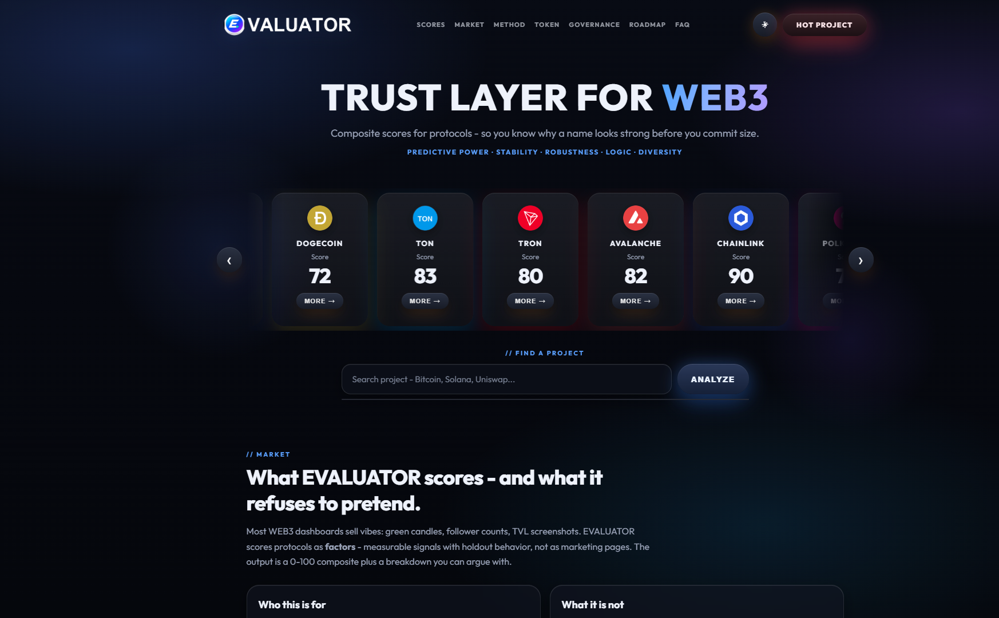
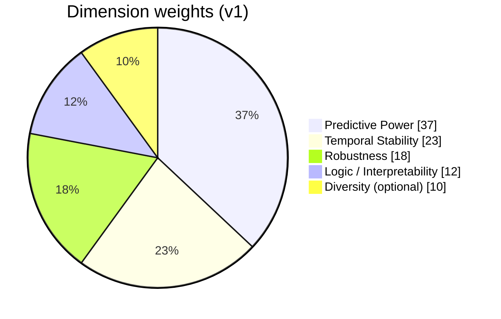
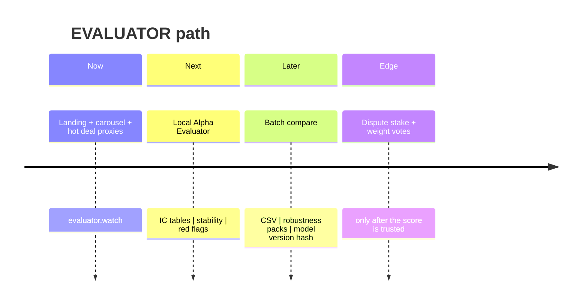

# EVALUATOR

**[evaluator.watch](https://evaluator.watch)** - trust layer for WEB3.

Composite **0-100** scores for protocols and factors: measurable signals with holdout behavior, not marketing pages.



---

## Why it exists

Most WEB3 dashboards sell vibes: green candles, follower counts, TVL screenshots.

EVALUATOR scores protocols as **factors** - IC, stability, robustness, interpretability - then shows a composite **plus the breakdown**. If you cannot see why a name looks strong, you cannot size it.

> A high score is **not** a buy signal. It means the published method likes the factor stack. Liquidity, legal risk, and portfolio constraints stay yours.

---

## Site

| | |
|---|---|
| **Product** | [https://evaluator.watch](https://evaluator.watch) |
| **Hot deals** | [https://evaluator.watch/hot.html](https://evaluator.watch/hot.html) |
| **This repo** | Landing + demo UI + scrape helpers |

### Pages

| Route | What you get |
|-------|----------------|
| `/` | Protocol carousel, search -> analyze, full product narrative |
| `/hot.html` | Early-stage / fundraising proxies from deal-flow scrapes |

### Sections on the landing

| Tab | Content |
|-----|---------|
| **SCORES** | Live carousel of protocol composites |
| **MARKET** | Who it is for, what it is not, how to read 0-100 |
| **METHOD** | Data stack, splits, ingest -> compute -> stress -> report |
| **TOKEN** | Access, stake, govern, factor bounties - utility first |
| **GOVERNANCE** | Red flags, dispute flow, on-chain vs off-chain |
| **ROADMAP** | Local MVP -> batch compare -> gated depth |
| **FAQ** | Straight answers |

---

## Scoring model (v1)

Weights normalize to a **0-100** composite after per-dimension scaling (z-score or min-max).



| Dimension | Weight | Measures |
|-----------|--------|----------|
| **Predictive Power** | 35-40% | IC + RankIC; ICIR = mean(IC) / std(IC) |
| **Temporal Stability** | 20-25% | Rank correlation across windows; share of periods with stable IC sign |
| **Robustness** | 15-20% | Shift windows, add noise, drop extremes, change 1d->5d horizon |
| **Logic / Interpretability** | 10-15% | Economic sense, no look-ahead / future leak |
| **Diversity** *(optional)* | ~10% | Correlation vs momentum / value / size - penalize redundancy |

### How to read a score

```text
 85-100 ████████████████████  Strong composite - still check red flags + sample length
 70-84  ███████████████░░░░░  Usable with caveats - watch stability + holdouts
 55-69  ██████████░░░░░░░░░░  Mixed - fine for research, weak as a core thesis
 <55    █████░░░░░░░░░░░░░░░  Weak / noisy - exploratory until the signal improves
```

```mermaid
flowchart LR
  A[Ingest prices + universe] --> B[Compute IC / RankIC / ICIR]
  B --> C[Stress: shifts | noise | horizons]
  C --> D[Composite 0-100 + breakdown]
  D --> E[Red flags + report]
```

**MVP shortcut:** Predictive Power + Temporal Stability alone already beats "look at Sharpe after one backtest."

---

## Method (short)

| Piece | Default |
|-------|---------|
| Prices | yfinance / local OHLCV CSV |
| Universe | 100-300 liquid names |
| Frequency | Daily (weekly for stress) |
| Split | Train 2015-2019 | Val 2020-2021 | Holdout 2022-> |
| Target | Forward return 1d / 5d / 20d |
| Cleaning | Corporate actions, volume outliers, delistings, look-ahead checks |

Alphas enter as manual formulas, genetic / LLM search, or agent signals - same evaluator, different feeds.

---

## Token and governance (intent)

Token gates **depth**, not homepage glances:

- unlock full IC tables / robustness packs
- stake against a published score (slash -> dispute pool on failed holdout)
- vote on weights, universe filters, red-flag thresholds
- fund factor bounties that clear IC + stability gates

**Design rule:** if a feature works without the token, keep it free.

Hard red flags the UI must surface: unstable IC sign, momentum clone, broke on 2022 holdout, look-ahead risk, sample too short, pure narrative with no IC.

---

## Roadmap



1. **MVP #1 (1-2 weeks)** - local factor evaluator (CLI / Streamlit): IC + stability + 0-100 + warnings
2. **MVP #2** - batch 50-200 candidates, compare, export - only if #1 is used
3. Skip early: full portfolio theater, alpha marketplace, 6-domain agent eval

---

## Live site

**[evaluator.watch](https://evaluator.watch)**

### Data helpers (dev)

```bash
python scripts/fetch_hot_projects.py   # refresh data/hot-projects.json
python scripts/fetch_icons.py          # protocol icons -> assets/icons/
python scripts/make_wordmark.py        # wordmark assets
```

---

## Repo map

```text
├── index.html / hot.html     product pages
├── app.js / hot.js           carousel, search, analyze, hot board
├── theme.js / cursor.js      theme + pointer FX
├── styles.css
├── data/hot-projects.json
├── assets/                   logo, wordmarks, icons
├── scripts/                  scrape + asset helpers
├── deploy/                   ready-to-upload static site
└── docs/preview.png
```

---

## Deploy

Upload the contents of `deploy/` to the web root of **evaluator.watch** (all files at the site root, keep folder structure).

Or use the zip: `deploy/evaluator-watch.zip`

---

## Disclaimer

Not financial advice. Research tooling only - not price prediction, not legal/security diligence, not a guarantee of alpha.

## License

MIT
